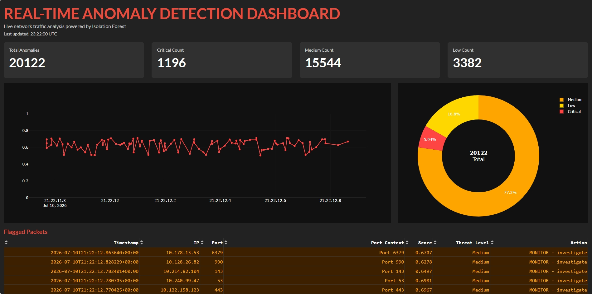

## REAL TIME ANOMALY DETECTION DASHBOARD
A machine learning system connected to network traffic data that analyses and flags suspicious activity.

## DEPLOYED LIVE
**[DASHBOARD LINK](https://anomaly-detection-uyga.onrender.com)**

## WHAT IT DOES
This application enables organisations to automatically detect and monitor suspicious network activity in real time using machine learning, helping security teams identify potential threats faster. By automating anomaly detection and visualisation, it reduces manual log analysis, improves consistency, and allows analysts to focus on investigating genuine security incidents.

Compared to manual network monitoring, this system operates continuously without fatigue and can detect subtle patterns that are difficult for humans to identify.

## Tech Stack

| Tool | Purpose |
|------|---------|
| Python 3.12 | Core language |
| scikit-learn | Isolation Forest model, LabelEncoder, StandardScaler |
| pandas / NumPy | Data loading, cleaning and preprocessing |
| Plotly Dash | Live interactive web dashboard |
| dash-bootstrap-components | Professional dashboard styling |
| SQLite / sqlite3 | Persistent anomaly storage |
| joblib | Saving and loading trained model |
| logging | Event and error recording |
| pathlib | Cross-platform file path handling |
| Git + GitHub | Version control and public code hosting |
| Render | Free cloud deployment |
| Gunicorn | Production web server |

## REPOSITORY STRUCTURE
anomaly-detection/

├── src/

│   ├── config.py          ← all constants and settings

│   ├── logger.py          ← centralised logging

│   ├── data_loader.py     ← loads and prepares NSL-KDD dataset

│   ├── model.py           ← trains and evaluates Isolation Forest

│   ├── analyser.py        ← threat scoring and action logic

│   ├── database.py        ← SQLite insert and query functions

│   ├── simulate.py        ← runs full dataset through pipeline

│   ├── dashboard.py       ← original Plotly Dash dashboard

│   └── dashboard_v2.py    ← upgraded professional dashboard

├── data/                  ← NSL-KDD dataset files

├── models/                ← saved model and scaler

├── logs/                  ← anomaly log file

├── requirements.txt

├── Procfile

├── runtime.txt

└── README.md

## HOW IT WORKS
The system is trained using the NSL-KDD dataset, which contains 125,973 network traffic records with 41 features describing each network connection. 

The anomaly detection model uses an Isolation Forest trained exclusively on normal network traffic, achieving 81% accuracy when identifying anomalous behaviour. 

Detected threats are stored and displayed in a Plotly Dash dashboard that refreshes every 2 seconds, providing live visualisations with colour-coded threat levels for quick analysis.

**Isolation Forest was selected because it is an unsupervised anomaly detection algorithm that can identify unusual network behaviour without requiring labelled attack data. This makes it well suited to detecting previously unseen threats.**

---
## KEY FEATURES
- Real-time network anomaly detection using Isolation Forest
- Live dashboard with automatic updates every 2 seconds
- Threat severity classification (Critical, Medium and Low)
- Interactive charts and threat distribution visualisations
- SQLite database for storing detected anomalies
- Modular Python architecture with logging and configuration management

## TECHNICAL ARCHITECTURE
- 5 INTEGRATED LAYERS
  
DATA -> PREPROCESSING -> ML -> STORAGE -> DASHBOARD

--- 
## SYSTEM ARCHITECTURE 
- Network traffic
- feature extraction
- isolation forest
- threat classification
- SQLite DB
- Plotly Dash dashboard

## DATASET
NSL-KDD network intrusion detection dataset:

- 125,973 training records

- 22,544 test records across 41 features covering DoS, Probe, R2L and U2R attack categories.
 
## WHAT I HAVE LEARNT
This project taught me how to build a complete machine learning pipeline, from data processing and model training through to real-time deployment and visualisation. 

I strengthened my software engineering skills by building a modular Python application with configuration management, logging, reusable components, and database integration to create a maintainable and scalable codebase. 

---
## SIMRAN GOSAL, 2026

Computer Science undergraduate

skg.simran.gosal@gmail.com

GitHub: https://github.com/Simran-Gosal
